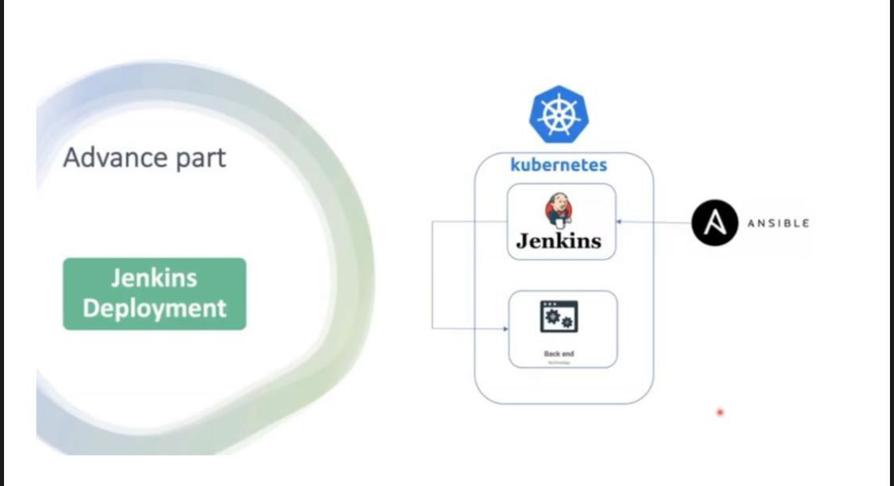
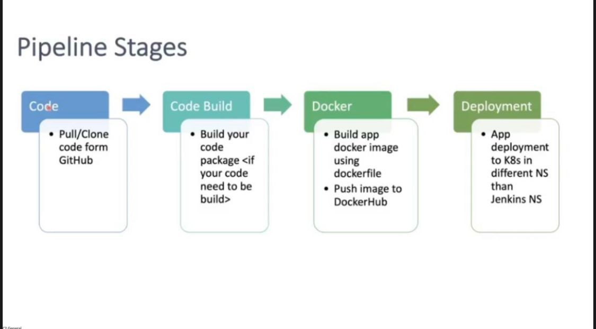
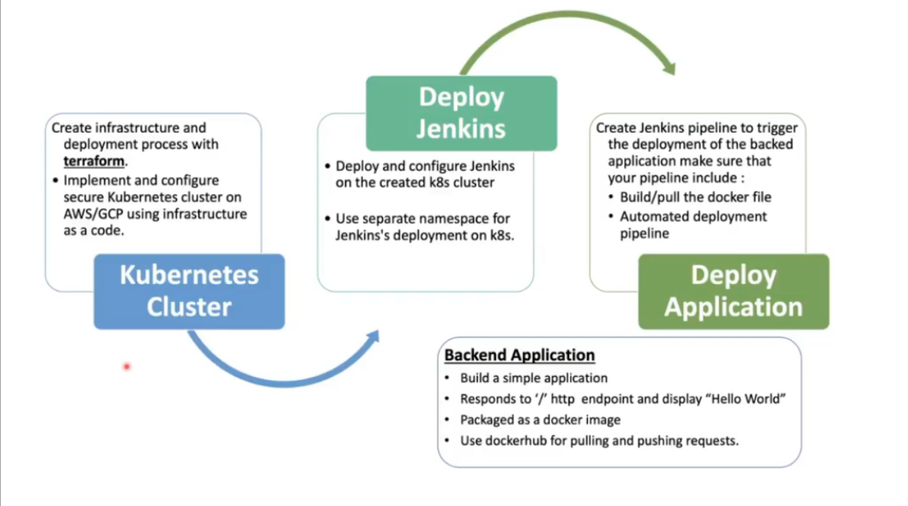

# DevOps-Final-Project-code
## CI/CD Pipeline To Deploy a backend app
 ##### steps: 
0. images 



### Create credintials in Jenkins:
 - Dockerhub credintials
 - Credintials for the new service account 

### CI pipeline:
#### 1. Pull code from GitHub

#### 2. Create Dockerfile
- to dockerize the app
```bash
$ docker build -t bojy1297/bakehouse .
$ docker push bojy1297/bakehouse
```
#### 3. Trigger CD pipeline to run
```bash
$ gcloud auth activate-service-account --key-file=${config}
$ gcloud container clusters get-credentials private-standerd-gke-cluster --zone us-central1-b --project abdallah-iti-377721
$ kubectl apply -f Deployment
```
#### 4. Trigger WebHook on github to Deploy with any push

### Finally: Destroy
```bash
$ terraform destroy
```
##### This app is for Eng karaim , Eng Mina maher from this repo <a href="https://github.com/kareemelkasaby1/BakeHouse" target="_blank">BakeHouse</a> 